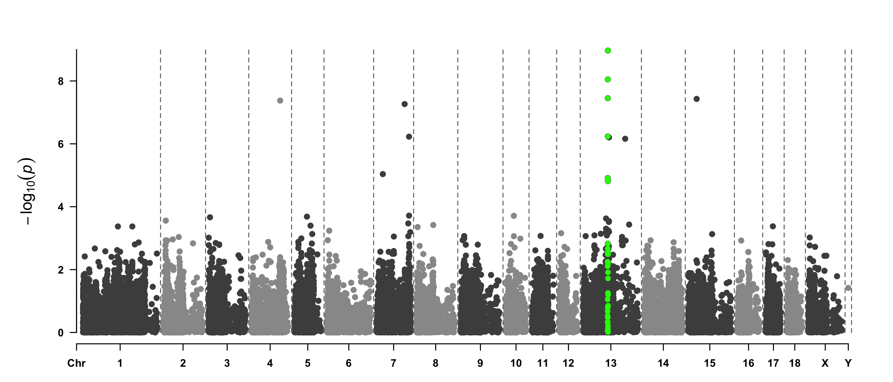
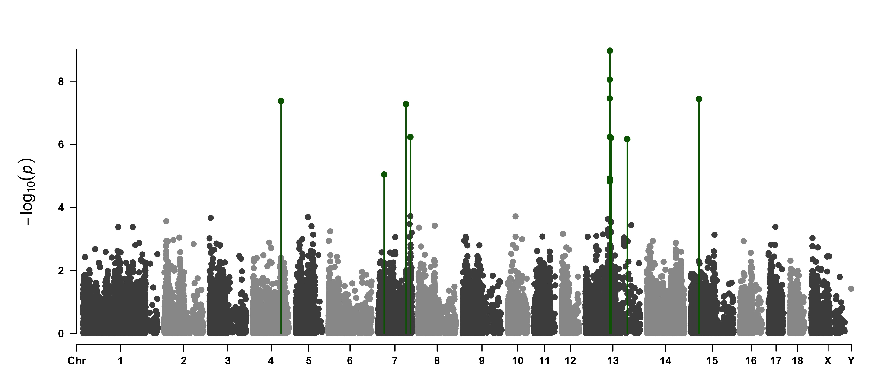
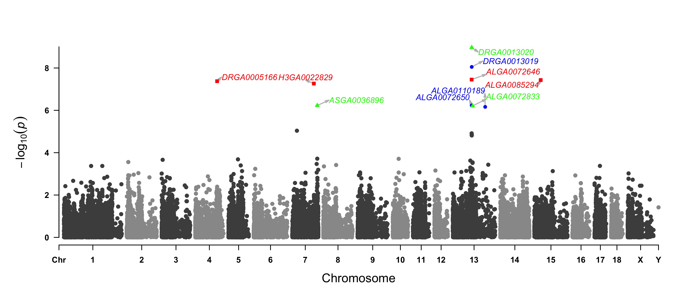
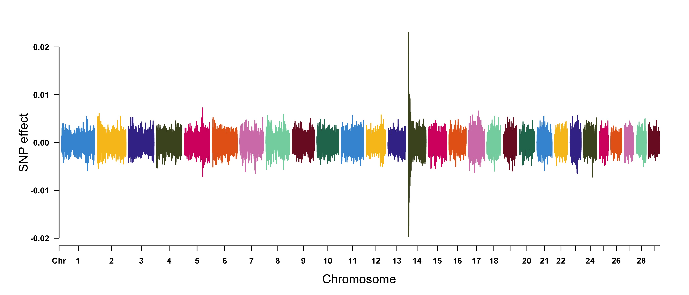
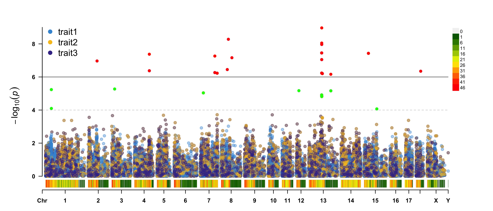
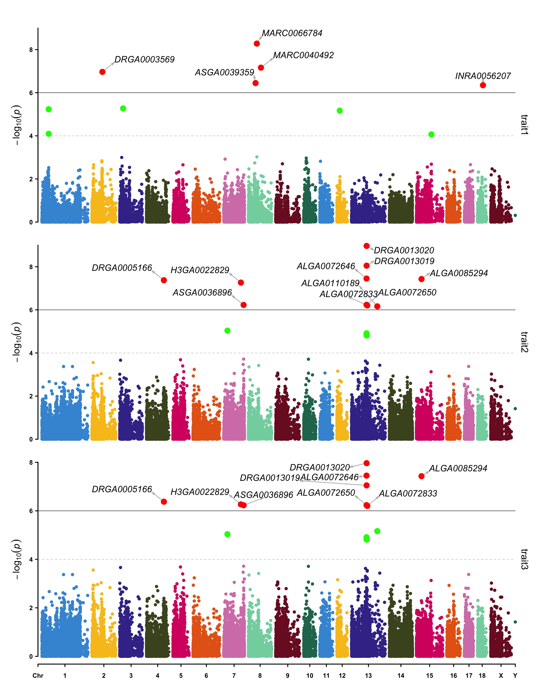

# CMplot 
[](https://github.com/YinLiLin/CMplot/issues/new) [](https://CRAN.R-project.org/package=CMplot) []()  [](https://CRAN.R-project.org/package=CMplot) <a href="https://hits.seeyoufarm.com"/></a>

## A high-quality drawing tool designed for Manhattan plot of genomic analysis

### :toolbox: Relevant software tools for genetic analyses and genomic breeding
<table>
    <tr>
	<td><g-emoji class="g-emoji" alias="mailbox" fallback-src="https://github.githubassets.com/images/icons/emoji/unicode/1f4eb.png">📫</g-emoji> <strong><a href="https://www.hiblup.com/" rel="nofollow">HIBLUP</a></strong>: Versatile and easy-to-use GS toolbox.</td>
        <td><g-emoji class="g-emoji" alias="four_leaf_clover" fallback-src="https://github.githubassets.com/images/icons/emoji/unicode/1f340.png">🍀</g-emoji> <strong><a href="https://github.com/xiaolei-lab/SIMER">SIMER</a></strong>: data simulation for life science and breeding.</td>
    </tr>
    <tr>
        <td><g-emoji class="g-emoji" alias="biking_man" fallback-src="https://github.githubassets.com/images/icons/emoji/unicode/1f6b4-2642.png">🚴&zwj;♂️</g-emoji> <strong><a href="https://github.com/YinLiLin/KAML">KAML</a></strong>: Advanced GS method for complex traits.</td>
        <td><g-emoji class="g-emoji" alias="mountain_snow" fallback-src="https://github.githubassets.com/images/icons/emoji/unicode/1f3d4.png">🏔️</g-emoji> <strong><a href="http://ianimal.pro/" rel="nofollow">IAnimal</a></strong>: an omics knowledgebase for animals.</td>
    </tr>
    <tr>
        <td><g-emoji class="g-emoji" alias="swimmer" fallback-src="https://github.githubassets.com/images/icons/emoji/unicode/1f3ca.png">🏊</g-emoji> <strong><a href="https://github.com/YinLiLin/hibayes">hibayes</a></strong>: A Bayesian-based GWAS and GS tool.</td>
        <td><g-emoji class="g-emoji" alias="postbox" fallback-src="https://github.githubassets.com/images/icons/emoji/unicode/1f4ee.png">📮</g-emoji> <strong><a href="https://github.com/xiaolei-lab/rMVP">rMVP</a></strong>: Efficient and easy-to-use GWAS tool.</td>
    </tr>
</table>

### Installation

**CMplot** is available on CRAN, so it can be installed with the following R code:

```r
> install.packages("CMplot")
> library("CMplot")

# if you want to use the latest version on GitHub:
> source("https://raw.githubusercontent.com/YinLiLin/CMplot/master/R/CMplot.r")
```

---

There are two example datasets attached in **CMplot**, users can export and view the details by following R code:

```r
> data(pig60K)   #calculated p-values by MLM
> data(cattle50K)   #calculated SNP effects by rrblup
> head(pig60K)

          SNP Chromosome Position    trait1     trait2     trait3
1 ALGA0000009          1    52297 0.7738187 0.51194318 0.51194318
2 ALGA0000014          1    79763 0.7738187 0.51194318 0.51194318
3 ALGA0000021          1   209568 0.7583016 0.98405289 0.98405289
4 ALGA0000022          1   292758 0.7200305 0.48887140 0.48887140
5 ALGA0000046          1   747831 0.9736840 0.22096836 0.22096836
6 ALGA0000047          1   761957 0.9174565 0.05753712 0.05753712

> head(cattle50K)

   SNP chr    pos Somatic cell score  Milk yield Fat percentage
1 SNP1   1  59082        0.000244361 0.000484255    0.001379210
2 SNP2   1 118164        0.000532272 0.000039800    0.000598951
3 SNP3   1 177246        0.001633058 0.000311645    0.000279427
4 SNP4   1 236328        0.001412865 0.000909370    0.001040161
5 SNP5   1 295410        0.000090700 0.002202973    0.000351394
6 SNP6   1 354493        0.000110681 0.000342628    0.000105792

```
As the example datasets, the first three columns are names, chromosome, position of SNPs respectively, the rest of columns are the pvalues of GWAS or effects of GS/GP for traits,  the number of traits is unlimited.
Note: if plotting SNP_Density, only the first three columns are needed.

Now **CMplot** could handle not only Genome-wide association study results, but also SNP effects, Fst, tajima's D and so on.

---

Total 50~ parameters are available in **CMplot**, typing ```?CMplot``` can get the detail function of all parameters.

---
### Citation
CMplot has been integrated into our developed GWAS package ```rMVP```, please cite the following paper:</br>
Yin, L. et al. [rMVP: A Memory-efficient, Visualization-enhanced, and Parallel-accelerated tool for Genome-Wide Association Study](https://doi.org/10.1016/j.gpb.2020.10.007), ***Genomics, Proteomics & Bioinformatics*** (2021), doi: 10.1016/j.gpb.2020.10.007.</br>

---
### SNP-density plot

```r
> CMplot(pig60K,type="p",plot.type="d",bin.size=1e6,chr.den.col=c("darkgreen", "yellow", "red"),file="jpg",memo="",dpi=300,
    main="illumilla_60K",file.output=TRUE,verbose=TRUE,width=9,height=6)
# users can personally set the windowsize and the min/max of legend by:
# bin.size=1e6
# bin.range=c(min, max)
# memo: add a character to the output file name
# chr.labels: change the chromosome names
# main: change the title of the plots, for manhattan plot, if there are more than one trait, main can be
#       assigned as a character vector containing the desired title for each trait
# NOTE: to show the full length of each chromosome, users can manually add every chromosome with one SNP, whose
# position equals to the length of corresponding chromosome, then assign the parameter in CMplot: CMplot(..., "chr.pos.max=TRUE").
```

<p align="center">
<a href="https://raw.githubusercontent.com/YinLiLin/R-CMplot/master/Figure/illumilla_60K.jpg">

</a>
</p>

---

### Circular-Manhattan plot

#### (1) Genome-wide association study(GWAS)

```r
> CMplot(pig60K,type="p",plot.type="c",chr.labels=paste("Chr",c(1:18,"X","Y"),sep=""),r=0.4,cir.legend=TRUE,
        outward=FALSE,cir.legend.col="black",cir.chr.h=1.3,chr.den.col="black",file="jpg",
        memo="",dpi=300,file.output=TRUE,verbose=TRUE,width=10,height=10)
```

<p align="center">
<a href="https://raw.githubusercontent.com/YinLiLin/R-CMplot/master/Figure/9.jpg">

</a>
</p>

```r
> CMplot(pig60K,type="p",plot.type="c",r=0.4,col=c("grey30","grey60"),chr.labels=paste("Chr",c(1:18,"X","Y"),sep=""),
      threshold=c(1e-6,1e-4),cir.chr.h=1.5,amplify=TRUE,threshold.lty=c(1,2),threshold.col=c("red",
      "blue"),signal.line=1,signal.col=c("red","green"),chr.den.col=c("darkgreen","yellow","red"),
      bin.size=1e6,outward=FALSE,file="jpg",memo="",dpi=300,file.output=TRUE,verbose=TRUE,width=10,height=10)

#Note:
1. if signal.line=NULL, the lines that crosse circles won't be added.
2. if the length of parameter 'chr.den.col' is not equal to 1, SNP density that counts 
   the number of SNP within given size('bin.size') will be plotted around the circle.
```

<p align="center">
<a href="https://raw.githubusercontent.com/YinLiLin/R-CMplot/master/Figure/10.jpg">

</a>
</p>


#### (2) Genomic Selection/Prediction(GS/GP)

```r
> CMplot(cattle50K,type="p",plot.type="c",LOG10=FALSE,outward=TRUE,col=matrix(c("#4DAF4A",NA,NA,"dodgerblue4",
         "deepskyblue",NA,"dodgerblue1", "olivedrab3", "darkgoldenrod1"), nrow=3, byrow=TRUE),
         chr.labels=paste("Chr",c(1:29),sep=""),threshold=NULL,r=1.2,cir.chr.h=1.5,cir.legend.cex=0.5,
         cir.band=1,file="jpg", memo="",dpi=300,chr.den.col="black",file.output=TRUE,verbose=TRUE,
         width=10,height=10)
        
#Note: parameter 'col' can be either vector or matrix, if a matrix, each trait can be plotted in different colors.
```

<p align="center">
<a href="https://raw.githubusercontent.com/YinLiLin/R-CMplot/master/Figure/11.jpg">

</a>
</p>

---

### Single_track Rectangular-Manhattan plot

#### Genome-wide association study(GWAS)

```r
> CMplot(pig60K,type="p",plot.type="m",LOG10=TRUE,threshold=NULL,file="jpg",memo="",dpi=300,
    file.output=TRUE,verbose=TRUE,width=14,height=6,chr.labels.angle=45)
# 'chr.labels.angle': adjust the angle of labels of x-axis (-90 < chr.labels.angle < 90).
```

<p align="center">
<a href="https://raw.githubusercontent.com/YinLiLin/R-CMplot/master/Figure/1.jpg">

</a>
</p>

#### Amplify signals on pch, cex and col

```r
> CMplot(pig60K, plot.type="m", col=c("grey30","grey60"), LOG10=TRUE, ylim=c(2,12), threshold=c(1e-6,1e-4),
        threshold.lty=c(1,2), threshold.lwd=c(1,1), threshold.col=c("black","grey"), amplify=TRUE,
        chr.den.col=NULL, signal.col=c("red","green"), signal.cex=c(1.5,1.5),signal.pch=c(19,19),
        file="jpg",memo="",dpi=300,file.output=TRUE,verbose=TRUE,width=14,height=6)

#Note: if the ylim is setted, then CMplot will only plot the points among this interval,
#       ylim can be vector or list, if it is a list, different traits can be assigned with
#       different range at y-axis.
#      'threshold' can be set for different traits, for example: threshold=list(c(1e-6,1e-4), NULL, 1e-5),
#       each list contains a vector of thresholds for each trait, NULL means no threshold for corresponding trait. 
```

<p align="center">
<a href="https://raw.githubusercontent.com/YinLiLin/R-CMplot/master/Figure/2.jpg">

</a>
</p>

#### Attach chromosome density on the bottom of Manhattan plot

```r
> CMplot(pig60K, plot.type="m", LOG10=TRUE, ylim=NULL, threshold=c(1e-6,1e-4),threshold.lty=c(1,2),
        threshold.lwd=c(1,1), threshold.col=c("black","grey"), amplify=TRUE,bin.size=1e6,
        chr.den.col=c("darkgreen", "yellow", "red"),signal.col=c("red","green"),signal.cex=c(1.5,1.5),
        signal.pch=c(19,19),file="jpg",memo="",dpi=300,file.output=TRUE,verbose=TRUE,
        width=14,height=6)
        
#Note: if the length of parameter 'chr.den.col' is bigger than 1, SNP density that counts 
   the number of SNP within given size('bin.size') will be plotted.
```

</p>
<p align="center">
<a href="https://raw.githubusercontent.com/YinLiLin/R-CMplot/master/Figure/2_2.jpg">

</a>

#### Highlight a group of SNPs on pch, cex, type, and col

```r
> signal <- pig60K$Position[which.min(pig60K$trait2)]
> SNPs <- pig60K$SNP[pig60K$Chromosome==13 & 
        pig60K$Position<(signal+1000000)&pig60K$Position>(signal-1000000)]
> CMplot(pig60K, plot.type="m",LOG10=TRUE,col=c("grey30","grey60"),highlight=SNPs,
        highlight.col="green",highlight.cex=1,highlight.pch=19,file="jpg",memo="",
        chr.border=TRUE,dpi=300,file.output=TRUE,verbose=TRUE,width=14,height=6)
# Note:
# 'highlight' could be vector or list, if it is a vector, all traits will use the same highlighted SNPs index, 
# if it is a list, the length of the list should equal to the number of traits.
# highlight.col, highlight.cex, highlight.pch can be value or vector, if its length equals to the length of highlighted SNPs,
# each SNPs have its special colour, size and shape.
```

</p>
<p align="center">
<a href="https://raw.githubusercontent.com/YinLiLin/R-CMplot/master/Figure/2-3.jpg">

</a>

```r
> SNPs <-  pig60K[pig60K$trait2 < 1e-4, 1]
> CMplot(pig60K,type="h",plot.type="m",LOG10=TRUE,highlight=SNPs,highlight.type="p",
        highlight.col=NULL,highlight.cex=1.2,highlight.pch=19,file="jpg",memo="",
        dpi=300,file.output=TRUE,verbose=TRUE,width=14,height=6,band=0.6)
```

</p>
<p align="center">
<a href="https://raw.githubusercontent.com/YinLiLin/R-CMplot/master/Figure/2_6.jpg">

</a>

```r
> SNPs <-  pig60K[pig60K$trait2 < 1e-4, 1]
> CMplot(pig60K,type="p",plot.type="m",LOG10=TRUE,highlight=SNPs,highlight.type="h",
        col=c("grey30","grey60"),highlight.col="darkgreen",highlight.cex=1.2,highlight.pch=19,
        file="jpg",dpi=300,file.output=TRUE,verbose=TRUE,width=14,height=6)
```

</p>
<p align="center">
<a href="https://raw.githubusercontent.com/YinLiLin/R-CMplot/master/Figure/2_6_1.jpg">

</a>
	
#### Visualize only one chromosome

```r
> CMplot(pig60K[pig60K$Chromosome==13, ], plot.type="m",LOG10=TRUE,col=c("grey60"),highlight=SNPs,
        highlight.col="green",highlight.cex=1,highlight.pch=19,file="jpg",memo="", 
        threshold=c(1e-6,1e-4),threshold.lty=c(1,2),threshold.lwd=c(1,2), width=9,height=6,
        threshold.col=c("red","blue"),amplify=FALSE,dpi=300,file.output=TRUE,verbose=TRUE)
```

</p>
<p align="center">
<a href="https://raw.githubusercontent.com/YinLiLin/R-CMplot/master/Figure/2_4.jpg">

</a>

#### add genes or SNP names around the highlighted SNPs

```r
> SNPs <- pig60K[pig60K[,5] < (0.05 / nrow(pig60K)), 1]
> genes <- paste("GENE", 1:length(SNPs), sep="_")
> set.seed(666666)
> CMplot(pig60K[,c(1:3,5)], plot.type="m",LOG10=TRUE,col=c("grey30","grey60"),highlight=SNPs,
        highlight.col=c("red","blue","green"),highlight.cex=1,highlight.pch=c(15:17), highlight.text=genes,      
        highlight.text.col=c("red","blue","green"),threshold=0.05/nrow(pig60K),threshold.lty=2,   
        amplify=FALSE,file="jpg",memo="",dpi=300,file.output=TRUE,verbose=TRUE,width=14,height=6)
# Note:
# 'highlight', 'highlight.text', 'highlight.text.xadj', 'highlight.text.yadj' could be vector or list, if it is a vector, 
# all traits will use the same highlighted SNPs index and text, if it is a list, the length of the list should equal to the number of traits.
# the order of 'highlight.text' must be consistent with 'highlight'
# highlight.text.cex: value or vecter, control the size of added text
# highlight.text.font: value or vecter, control the font of added text
# highlight.text.xadj: value or vecter or list for multiple traits, -1, 0, 1 limited, control the position of text around the highlighted SNPs: -1(left), 0(center), 1(right)
# highlight.text.yadj: value or vector or list for multiple traits, same as above, -1(down), 0(center), 1(up)
```

</p>
<p align="center">
<a href="https://raw.githubusercontent.com/YinLiLin/R-CMplot/master/Figure/2-5.jpg">

</a>
 
#### Genomic Selection/Prediction(GS/GP) or other none p-values

```r
> CMplot(cattle50K, plot.type="m", band=0.5, LOG10=FALSE, ylab="SNP effect",threshold=0.015,
        threshold.lty=2, threshold.lwd=1, threshold.col="red", amplify=TRUE, width=14,height=6,
        signal.col=NULL, chr.den.col=NULL, file="jpg",memo="",dpi=300,file.output=TRUE,
        verbose=TRUE,cex=0.8)
#Note: if signal.col=NULL, the significant SNPs will be plotted with original colors.
```

<p align="center">
<a href="https://raw.githubusercontent.com/YinLiLin/R-CMplot/master/Figure/3.jpg">

</a>
</p>

```r
> cattle50K[,4:ncol(cattle50K)] <- apply(cattle50K[,4:ncol(cattle50K)], 2, 
         function(x) x*sample(c(1,-1), length(x), rep=TRUE))
> CMplot(cattle50K, type="h",plot.type="m", band=0.5, LOG10=FALSE, ylab="SNP effect",ylim=c(-0.02,0.02),
        threshold.lty=2, threshold.lwd=1, threshold.col="red", amplify=FALSE,cex=0.6,
        chr.den.col=NULL, file="jpg",memo="",dpi=300,file.output=TRUE,verbose=TRUE)

#Note: Positive and negative values are acceptable.
```

<p align="center">
<a href="https://raw.githubusercontent.com/YinLiLin/R-CMplot/master/Figure/PN_1.jpg">

</a>
</p>

### Multi_tracks Rectangular-Manhattan plot

```r
SNPs <- list(
	pig60K$SNP[pig60K$trait1<1e-6],
	pig60K$SNP[pig60K$trait2<1e-6],
	pig60K$SNP[pig60K$trait3<1e-6]
)
CMplot(pig60K, plot.type="m",multracks=TRUE,threshold=c(1e-6,1e-4),threshold.lty=c(1,2), 
        threshold.lwd=c(1,1), threshold.col=c("black","grey"), amplify=TRUE,bin.size=1e6,
        chr.den.col=c("darkgreen", "yellow", "red"), signal.col=c("red","green","blue"),
        signal.cex=1, file="jpg",memo="",dpi=300,file.output=TRUE,verbose=TRUE,
        highlight=SNPs, highlight.text=SNPs, highlight.text.cex=1.4)
#Note: if you are not supposed to change the color of signal, 
#          please set signal.col=NULL and highlight.col=NULL.
```

#### a. all traits in one axes:

<p align="center">
<a href="https://raw.githubusercontent.com/YinLiLin/R-CMplot/master/Figure/4_1.jpg">

</a>
</p>

#### b. all traits in separated axes:

<p align="center">
<a href="https://raw.githubusercontent.com/YinLiLin/R-CMplot/master/Figure/5_new.jpg">

</a>
</p>

---

### Single_track Q-Q plot

```r
> CMplot(pig60K,plot.type="q",box=FALSE,file="jpg",memo="",dpi=300,
    conf.int=TRUE,conf.int.col=NULL,threshold.col="red",threshold.lty=2,
    file.output=TRUE,verbose=TRUE,width=5,height=5)
```

<p align="center">
<a href="https://raw.githubusercontent.com/YinLiLin/R-CMplot/master/Figure/6.jpg">

</a>
</p>

### Multi_tracks Q-Q plot

```r
> pig60K$trait1[sample(1:nrow(pig60K), round(nrow(pig60K)*0.80))] <- NA
> pig60K$trait2[sample(1:nrow(pig60K), round(nrow(pig60K)*0.25))] <- NA
> CMplot(pig60K,plot.type="q",col=c("dodgerblue1", "olivedrab3", "darkgoldenrod1"),threshold=1e-6,
        ylab.pos=2,signal.pch=c(19,6,4),signal.cex=1.2,signal.col="red",conf.int=TRUE,box=FALSE,multracks=
        TRUE,cex.axis=2,file="jpg",memo="",dpi=300,file.output=TRUE,verbose=TRUE,ylim=c(0,8),width=5,height=5)
```

#### a. all traits in a axes:

<p align="center">
<a href="https://raw.githubusercontent.com/YinLiLin/R-CMplot/master/Figure/8.jpg">

</a>
</p>

#### b. all traits in separated axes:

<p align="center">
<a href="https://raw.githubusercontent.com/YinLiLin/R-CMplot/master/Figure/7.jpg">

</a>
</p>

---

### Contact
Questions, suggestions, and bug reports are welcome and appreciated.
- **Author:** Lilin Yin
- **Contact:** ylilin@163.com
- **QQ group:** 166305848
- **Institution:** [*Huazhong agricultural university*](http://www.hzau.edu.cn/en/HOME.htm)

<p align="center">
<a href="https://ga-beacon.appspot.com/UA-132438702-1/R-CMplot/readme?pixel">

</a>
</p>

