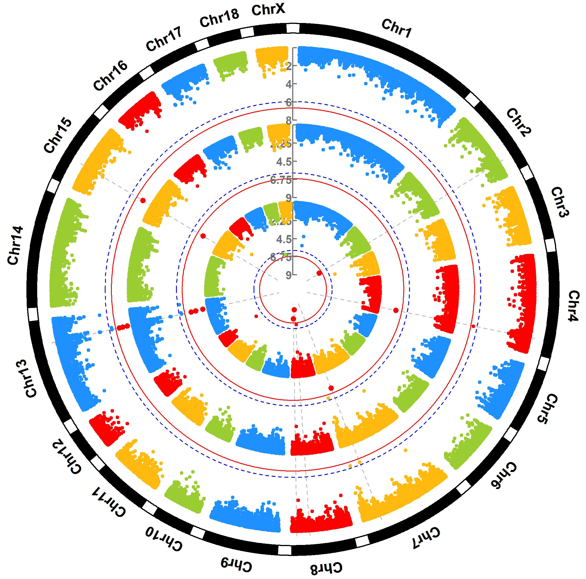
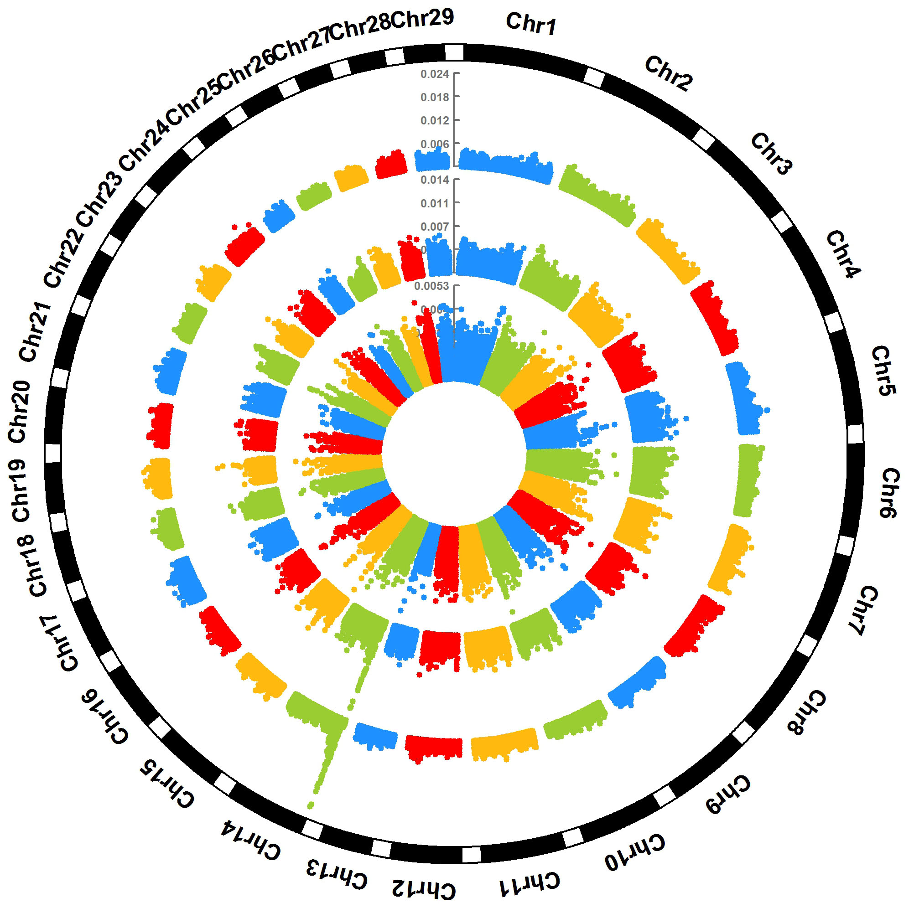
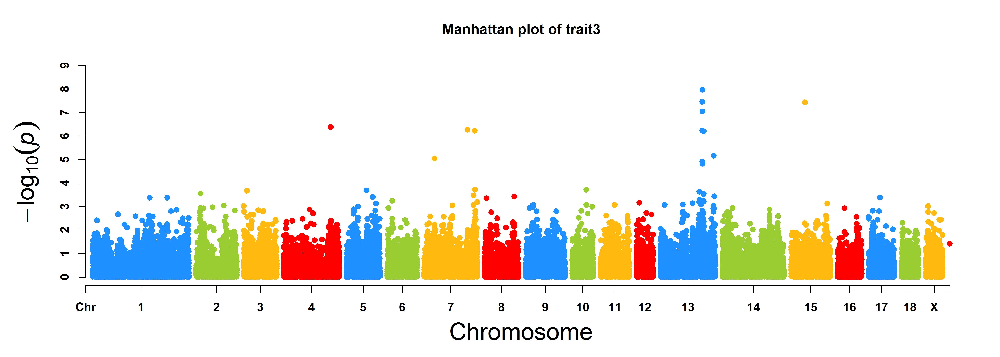
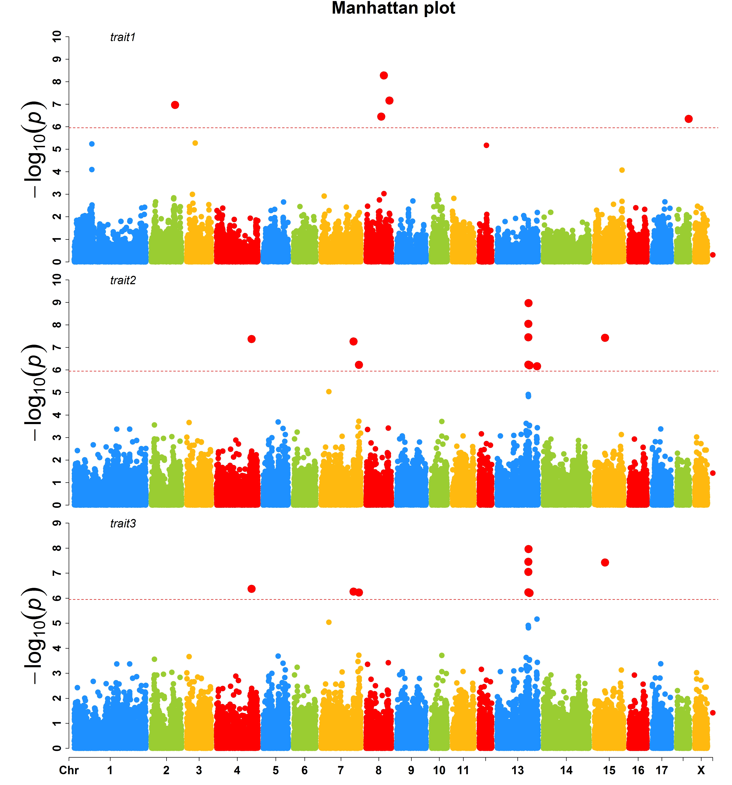
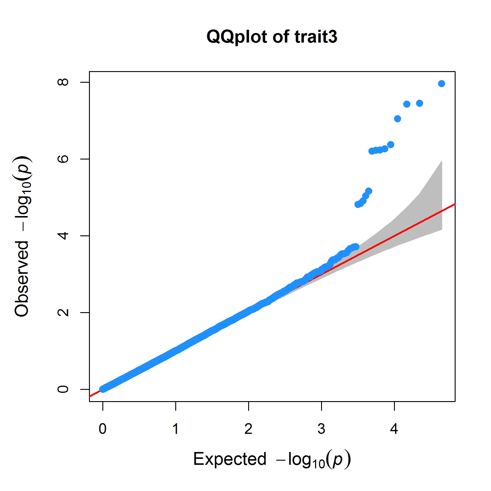

CMplot [](https://github.com/YinLiLin/R-CMplot/issues) [](https://cran.r-project.org/web/packages/CMplot/)
=========

## A high-quality drawing tool designed for genome-wide association study

### Installation

**CMplot** is available on CRAN, so it can be installed with the following R code:

```r
> install.packages("CMplot")
> library("CMplot")
#(optional)if you want to use the latest version:
#source("https://raw.githubusercontent.com/YinLiLin/R-CMplot/master/CMplot.r")
```

---

There are two example datasets attached in **CMplot**, users can export and view the details by following R code:

```r
> data(pig60K)   #calculated p-values by MLM
> data(cattle50K)   #calculated SNP effects by rrblup

> head(pig60K)

          SNP Chromosome Position    trait1     trait2     trait3
1 ALGA0000009          1    52297 0.7738187 0.51194318 0.51194318
2 ALGA0000014          1    79763 0.7738187 0.51194318 0.51194318
3 ALGA0000021          1   209568 0.7583016 0.98405289 0.98405289
4 ALGA0000022          1   292758 0.7200305 0.48887140 0.48887140
5 ALGA0000046          1   747831 0.9736840 0.22096836 0.22096836
6 ALGA0000047          1   761957 0.9174565 0.05753712 0.05753712

> head(cattle50K)

   SNP chr    pos Somatic cell score  Milk yield Fat percentage
1 SNP1   1  59082        0.000244361 0.000484255    0.001379210
2 SNP2   1 118164        0.000532272 0.000039800    0.000598951
3 SNP3   1 177246        0.001633058 0.000311645    0.000279427
4 SNP4   1 236328        0.001412865 0.000909370    0.001040161
5 SNP5   1 295410        0.000090700 0.002202973    0.000351394
6 SNP6   1 354493        0.000110681 0.000342628    0.000105792

```
As the example datasets, the first three columns are names, chromosome, position of SNPs respectively, the res of columns are the pvalues of GWAS or effects of GS/GP for traits,  the number of traits is unlimited.
Note: if plotting SNP_Density, only the first three columns are needed.

---

Total 40 parameters are available in **CMplot**, typing ```?CMplot``` can get the detail function of all parameters.

---

### SNP-density plot

```r
> CMplot(pig60K,plot.type="d",col=c("darkgreen", "yellow", "red"),file="jpg",memo="",dpi=300)
# users can personally set the windowsize and the max of legend by:
# bin.size=1e6
# bin.max=N
# memo: add a character to the output file name.
# but the latest version should be sourced.
```

<p align="center">
<a href="https://raw.githubusercontent.com/YinLiLin/R-CMplot/master/Figure/illumilla_60K.jpg">

</a>
</p>

---

### Circular-Manhattan plot

#### (1) Genome-wide association study(GWAS)

```r
> CMplot(pig60K,plot.type="c",chr.labels=paste("Chr",c(1:18,"X"),sep=""),threshold=c(0.05,0.01),
      cir.chr.h=1,amplify=TRUE,threshold.lty=c(2,1),threshold.col=c("blue","red"),signal.line=1,
      signal.col="red",file="jpg",memo="",dpi=300)
#Note: if signal.line=NULL, the lines that crosse circles won't be added.
```

<p align="center">
<a href="https://raw.githubusercontent.com/YinLiLin/R-CMplot/master/Figure/Circular-Manhattan.jpg">

</a>
</p>

#### (2) Genomic Selection/Prediction(GS/GP)

```r
> CMplot(cattle50K,plot.type="c",LOG10=FALSE,outward=TRUE,chr.labels=paste("Chr",c(1:29),sep=""),
r=1.2,cir.chr.h=1.3,cir.legend.cex=0.5,cir.band=1,threshold=NULL,file="jpg",memo="",dpi=300)
```

<p align="center">
<a href="https://raw.githubusercontent.com/YinLiLin/R-CMplot/master/Figure/Circular-Manhattan.cattle.jpg">

</a>
</p>

---

### Single_track Rectangular-Manhattan plot

#### (1) Genome-wide association study(GWAS)

```r
> CMplot(pig60K[,c(1:3,6)],plot.type="m",threshold=NULL,file="jpg",memo="",dpi=300)
```

<p align="center">
<a href="https://raw.githubusercontent.com/YinLiLin/R-CMplot/master/Figure/Rectangular-Manhattan.trait3.jpg">

</a>
</p>

#### (2) Genomic Selection/Prediction(GS/GP)

```r
> CMplot(cattle50K,plot.type="m",LOG10=FALSE,ylab="SNP effect",threshold=NULL,file="jpg",memo="",dpi=300)
```

<p align="center">
<a href="https://raw.githubusercontent.com/YinLiLin/R-CMplot/master/Figure/Rectangular-Manhattan.Fat percentage.jpg">

</a>
</p>

### Multi_tracks Rectangular-Manhattan plot

```r
> CMplot(pig60K,plot.type="m",threshold=0.05,amplify=TRUE,multracks=TRUE,file="jpg",memo="",dpi=300)
```

<p align="center">
<a href="https://raw.githubusercontent.com/YinLiLin/R-CMplot/master/Figure/Multi_Rectangular-Manhattan.trait1.trait2.trait3.jpg">

</a>
</p>

---

### Single_track Q-Q plot

```r
> CMplot(pig60K[,c(1:3,6)],plot.type="q",conf.int=TRUE,conf.int.col="grey",file="jpg",memo="",dpi=300)
```

<p align="center">
<a href="https://raw.githubusercontent.com/YinLiLin/R-CMplot/master/Figure/QQplot.trait3.jpg">

</a>
</p>

### Multi_tracks Q-Q plot

```r
> CMplot(pig60K,plot.type="q",conf.int=TRUE,conf.int.col="grey",multracks=TRUE,file="jpg",memo="",dpi=300)
```

<p align="center">
<a href="https://raw.githubusercontent.com/YinLiLin/R-CMplot/master/Figure/Multi_QQplot.trait1.trait2.trait3.jpg">

</a>
</p>

---

### Contact
Questions, suggestions, and bug reports are welcome and appreciated.
- **Author:** Lilin Yin
- **Contact:** ylilin@163.com
- **Institution:** [*Huazhong agricultural university*](http://www.hzau.edu.cn/2014/ch/)
