CMplot [](https://github.com/YinLiLin/R-CMplot/issues) [](https://cran.r-project.org/web/packages/CMplot/)
=========

## A high-quality drawing tool designed for Manhattan plot of genomic analysis

### Installation

**CMplot** is available on CRAN, so it can be installed with the following R code:

```r
> install.packages("CMplot")
> library("CMplot")
#(optional)if you want to use the latest version:
#source("https://raw.githubusercontent.com/YinLiLin/R-CMplot/master/R/CMplot.r")
```

---

There are two example datasets attached in **CMplot**, users can export and view the details by following R code:

```r
> data(pig60K)   #calculated p-values by MLM
> data(cattle50K)   #calculated SNP effects by rrblup
> head(pig60K)

          SNP Chromosome Position    trait1     trait2     trait3
1 ALGA0000009          1    52297 0.7738187 0.51194318 0.51194318
2 ALGA0000014          1    79763 0.7738187 0.51194318 0.51194318
3 ALGA0000021          1   209568 0.7583016 0.98405289 0.98405289
4 ALGA0000022          1   292758 0.7200305 0.48887140 0.48887140
5 ALGA0000046          1   747831 0.9736840 0.22096836 0.22096836
6 ALGA0000047          1   761957 0.9174565 0.05753712 0.05753712

> head(cattle50K)

   SNP chr    pos Somatic cell score  Milk yield Fat percentage
1 SNP1   1  59082        0.000244361 0.000484255    0.001379210
2 SNP2   1 118164        0.000532272 0.000039800    0.000598951
3 SNP3   1 177246        0.001633058 0.000311645    0.000279427
4 SNP4   1 236328        0.001412865 0.000909370    0.001040161
5 SNP5   1 295410        0.000090700 0.002202973    0.000351394
6 SNP6   1 354493        0.000110681 0.000342628    0.000105792

```
As the example datasets, the first three columns are names, chromosome, position of SNPs respectively, the res of columns are the pvalues of GWAS or effects of GS/GP for traits,  the number of traits is unlimited.
Note: if plotting SNP_Density, only the first three columns are needed.

Now **CMplot** could handle not only Genome-wide association study results, but also SNP effects, Fst, tajima's D and so on.

---

Total 50~ parameters are available in **CMplot**, typing ```?CMplot``` can get the detail function of all parameters.

---
### Citation
**waiting for updating...**<br>

---
### SNP-density plot

```r
> CMplot(pig60K,plot.type="d",bin.size=1e6,chr.den.col=c("darkgreen", "yellow", "red"),file="jpg",memo="",dpi=300,
    file.output=TRUE,verbose=TRUE,width=9,height=6)
# users can personally set the windowsize and the min/max of legend by:
# bin.size=1e6
# bin.range=c(min, max)
# memo: add a character to the output file name
# chr.labels: change the chromosome names
```

<p align="center">
<a href="https://raw.githubusercontent.com/YinLiLin/R-CMplot/master/Figure/illumilla_60K.jpg">
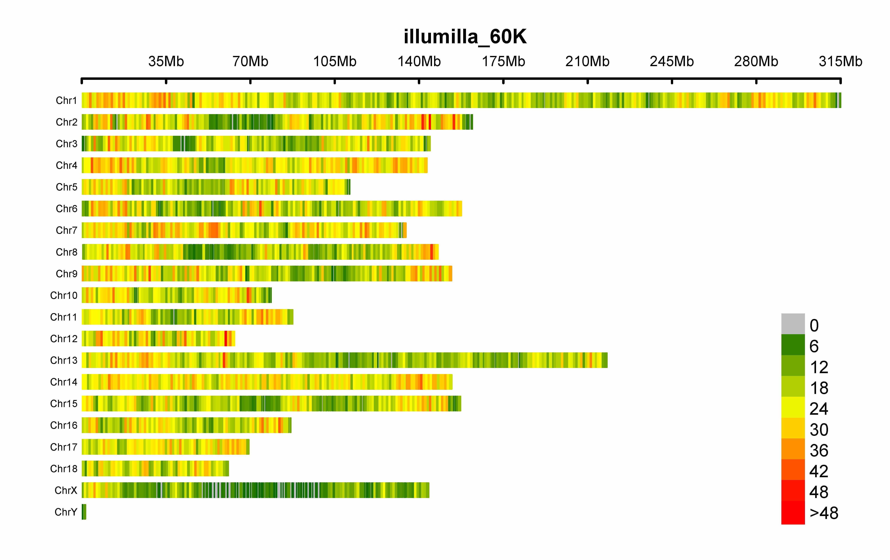
</a>
</p>

---

### Circular-Manhattan plot

#### (1) Genome-wide association study(GWAS)

```r
> CMplot(pig60K,plot.type="c",chr.labels=paste("Chr",c(1:18,"X"),sep=""),r=0.4,cir.legend=TRUE,
        outward=FALSE,cir.legend.col="black",cir.chr.h=1.3,chr.den.col="black",file="jpg",
        memo="",dpi=300,file.output=TRUE,verbose=TRUE,width=10,height=10)
```

<p align="center">
<a href="https://raw.githubusercontent.com/YinLiLin/R-CMplot/master/Figure/9.jpg">
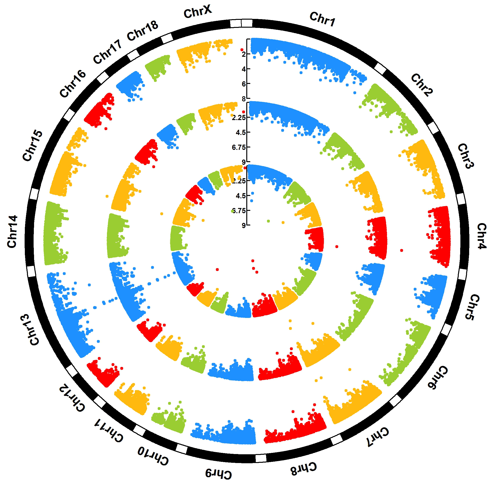
</a>
</p>

```r
> CMplot(pig60K,plot.type="c",r=0.4,col=c("grey30","grey60"),chr.labels=paste("Chr",c(1:18,"X"),sep=""),
      threshold=c(1e-6,1e-4),cir.chr.h=1.5,amplify=TRUE,threshold.lty=c(1,2),threshold.col=c("red",
      "blue"),signal.line=1,signal.col=c("red","green"),chr.den.col=c("darkgreen","yellow","red"),
      bin.size=1e6,outward=FALSE,file="jpg",memo="",dpi=300,file.output=TRUE,verbose=TRUE,width=10,height=10)

#Note:
1. if signal.line=NULL, the lines that crosse circles won't be added.
2. if the length of parameter 'chr.den.col' is not equal to 1, SNP density that counts 
   the number of SNP within given size('bin.size') will be plotted around the circle.
```

<p align="center">
<a href="https://raw.githubusercontent.com/YinLiLin/R-CMplot/master/Figure/10.jpg">
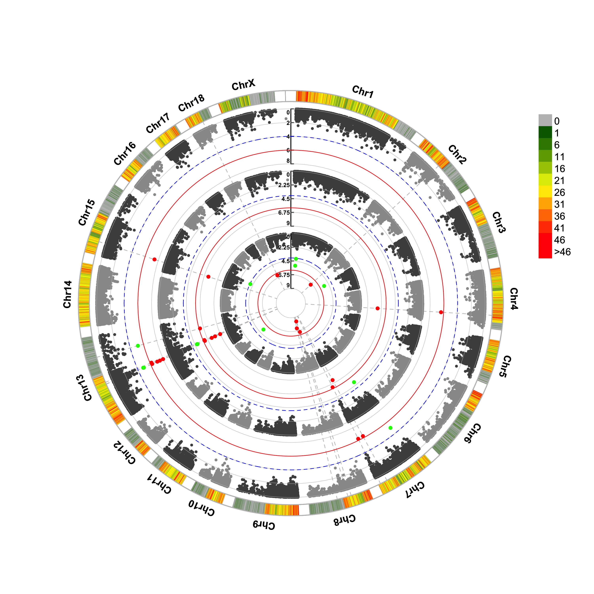
</a>
</p>


#### (2) Genomic Selection/Prediction(GS/GP)

```r
> CMplot(cattle50K,plot.type="c",LOG10=FALSE,outward=TRUE,col=matrix(c("#4DAF4A",NA,NA,"dodgerblue4",
         "deepskyblue",NA,"dodgerblue1", "olivedrab3", "darkgoldenrod1"), nrow=3, byrow=TRUE),
         chr.labels=paste("Chr",c(1:29),sep=""),threshold=NULL,r=1.2,cir.chr.h=1.5,cir.legend.cex=0.5,
         cir.band=1,file="jpg", memo="",dpi=300,chr.den.col="black",file.output=TRUE,verbose=TRUE,
         width=10,height=10)
        
#Note: parameter 'col' can be either vector or matrix, if a matrix, each trait can be plotted in different colors.
```

<p align="center">
<a href="https://raw.githubusercontent.com/YinLiLin/R-CMplot/master/Figure/11.jpg">
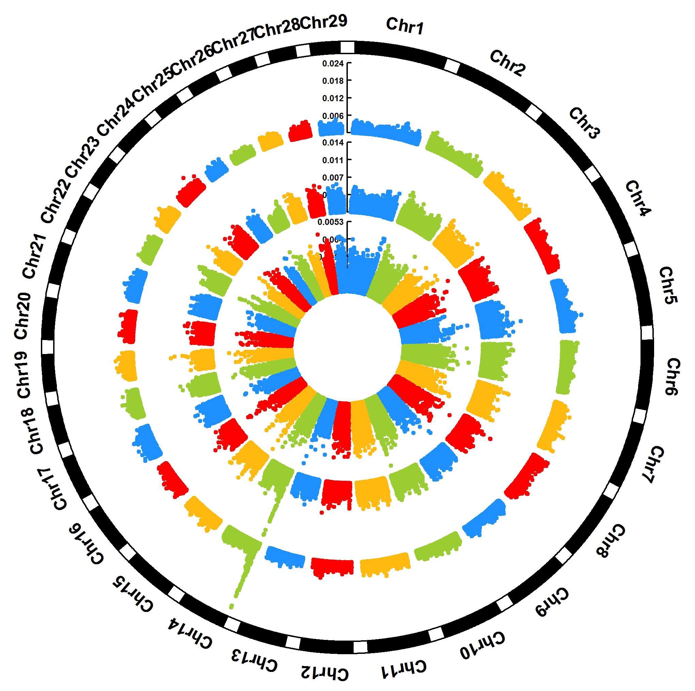
</a>
</p>

---

### Single_track Rectangular-Manhattan plot

#### Genome-wide association study(GWAS)

```r
> CMplot(pig60K,plot.type="m",LOG10=TRUE,threshold=NULL,file="jpg",memo="",dpi=300,
    file.output=TRUE,verbose=TRUE,width=14,height=6)
```

<p align="center">
<a href="https://raw.githubusercontent.com/YinLiLin/R-CMplot/master/Figure/1.jpg">
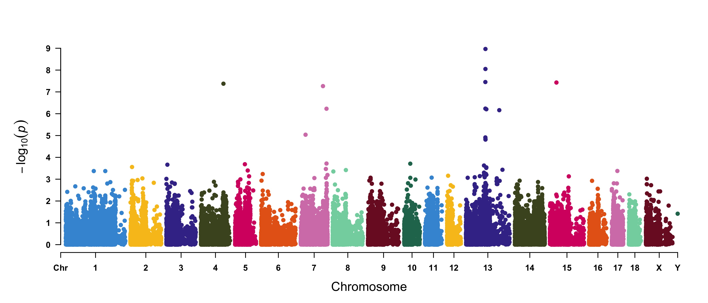
</a>
</p>

#### Amplify signals on pch, cex and col

```r
> CMplot(pig60K, plot.type="m", col=c("grey30","grey60"), LOG10=TRUE, ylim=c(2,12), threshold=c(1e-6,1e-4),
        threshold.lty=c(1,2), threshold.lwd=c(1,1), threshold.col=c("black","grey"), amplify=TRUE,
        chr.den.col=NULL, signal.col=c("red","green"), signal.cex=c(1,1),signal.pch=c(19,19),
        file="jpg",memo="",dpi=300,file.output=TRUE,verbose=TRUE,width=14,height=6)

#Note: if the ylim is setted, then CMplot will only plot the ponits which among this interval.
```

<p align="center">
<a href="https://raw.githubusercontent.com/YinLiLin/R-CMplot/master/Figure/2.jpg">
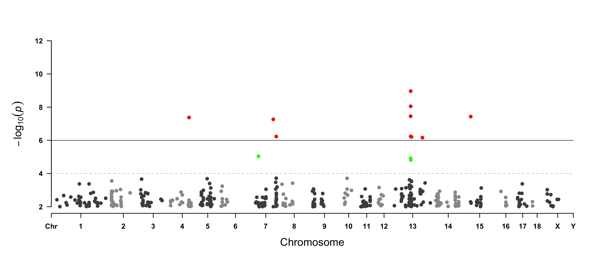
</a>
</p>

#### Attach chromosome density on the bottom of Manhattan plot

```r
> CMplot(pig60K, plot.type="m", LOG10=TRUE, ylim=NULL, threshold=c(1e-6,1e-4),threshold.lty=c(1,2),
        threshold.lwd=c(1,1), threshold.col=c("black","grey"), amplify=TRUE,bin.size=1e6,
        chr.den.col=c("darkgreen", "yellow", "red"),signal.col=c("red","green"),signal.cex=c(1,1),
        signal.pch=c(19,19),file="jpg",memo="",dpi=300,file.output=TRUE,verbose=TRUE,
        width=14,height=6)
        
#Note: if the length of parameter 'chr.den.col' is bigger than 1, SNP density that counts 
   the number of SNP within given size('bin.size') will be plotted.
```

</p>
<p align="center">
<a href="https://raw.githubusercontent.com/YinLiLin/R-CMplot/master/Figure/2_2.jpg">
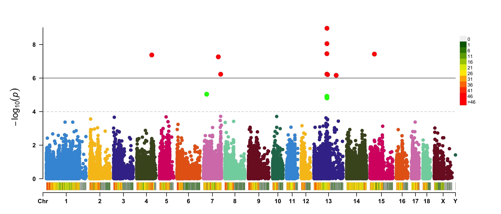
</a>

#### Highlight a group of SNPs on pch, cex and col

```r
> signal <- pig60K$Position[which.min(pig60K$trait2)]
> SNPs <- pig60K$SNP[pig60K$Chromosome==13 & 
        pig60K$Position<(signal+1000000)&pig60K$Position>(signal-1000000)]
> CMplot(pig60K, plot.type="m",LOG10=TRUE,col=c("grey30","grey60"),highlight=SNPs,
        highlight.col="green",highlight.cex=1,highlight.pch=19,file="jpg",memo="",
        dpi=300,file.output=TRUE,verbose=TRUE,width=14,height=6)
```

</p>
<p align="center">
<a href="https://raw.githubusercontent.com/YinLiLin/R-CMplot/master/Figure/2_3.jpg">
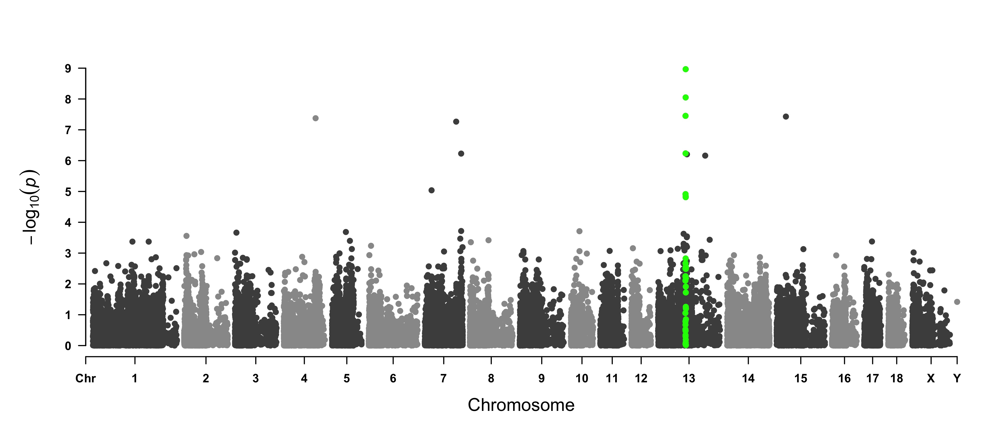
</a>

#### Visualize only one chromosome

```r
> CMplot(pig60K[pig60K$Chromosome==13, ], plot.type="m",LOG10=TRUE,col=c("grey60"),highlight=SNPs,
        highlight.col="green",highlight.cex=1,highlight.pch=19,file="jpg",memo="", 
        threshold=c(1e-6,1e-4),threshold.lty=c(1,2),threshold.lwd=c(1,2), width=9,height=6,
        threshold.col=c("red","blue"),amplify=FALSE,dpi=300,file.output=TRUE,verbose=TRUE)
```

</p>
<p align="center">
<a href="https://raw.githubusercontent.com/YinLiLin/R-CMplot/master/Figure/2_4.jpg">
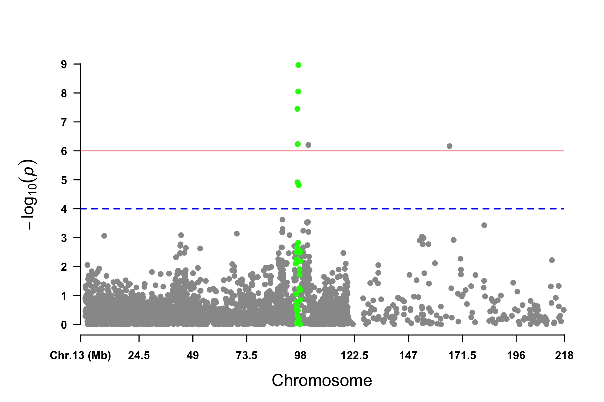
</a>

#### Genomic Selection/Prediction(GS/GP) or other none p-values

```r
> CMplot(cattle50K, plot.type="m", band=0.5, LOG10=FALSE, ylab="SNP effect",threshold=0.015,
        threshold.lty=2, threshold.lwd=1, threshold.col="red", amplify=TRUE, width=14,height=6,
        signal.col=NULL, chr.den.col=NULL, file="jpg",memo="",dpi=300,file.output=TRUE,
        verbose=TRUE,cex=0.8)
#Note: if signal.col=NULL, the significant SNPs will be plotted with original colors.
```

<p align="center">
<a href="https://raw.githubusercontent.com/YinLiLin/R-CMplot/master/Figure/3.jpg">
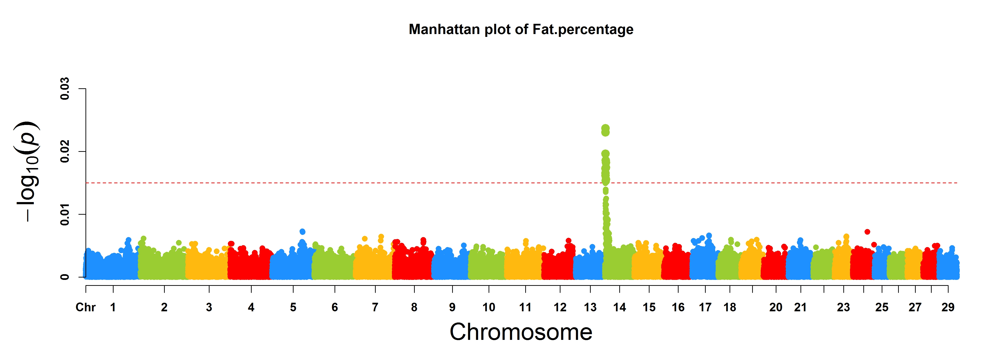
</a>
</p>

```r
> cattle50K[,4:ncol(cattle50K)] <- apply(cattle50K[,4:ncol(cattle50K)], 2, 
         function(x) x*sample(c(1,-1), length(x), rep=TRUE))
> CMplot(cattle50K, plot.type="m", band=0, LOG10=FALSE, ylab="SNP effect",ylim=c(-0.02,0.02),
        threshold.lty=2, threshold.lwd=1, threshold.col="red", amplify=FALSE,cex=0.6,
        chr.den.col=NULL, file="jpg",memo="",dpi=300,file.output=TRUE,verbose=TRUE)

#Note: Positive and negative values are acceptable.
```

<p align="center">
<a href="https://raw.githubusercontent.com/YinLiLin/R-CMplot/master/Figure/PN.jpg">
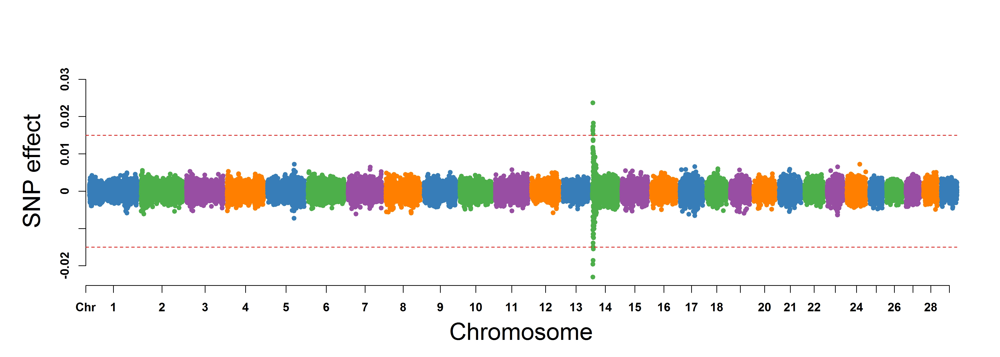
</a>
</p>

### Multi_tracks Rectangular-Manhattan plot

```r
> CMplot(pig60K, plot.type="m", multracks=TRUE, threshold=c(1e-6,1e-4),threshold.lty=c(1,2), 
        threshold.lwd=c(1,1), threshold.col=c("black","grey"), amplify=TRUE,bin.size=1e6,
        chr.den.col=c("darkgreen", "yellow", "red"), signal.col=c("red","green"),signal.cex=c(1,1),
        file="jpg",memo="",dpi=300,file.output=TRUE,verbose=TRUE)
```

#### a. all traits in a axes:

<p align="center">
<a href="https://raw.githubusercontent.com/YinLiLin/R-CMplot/master/Figure/4.jpg">
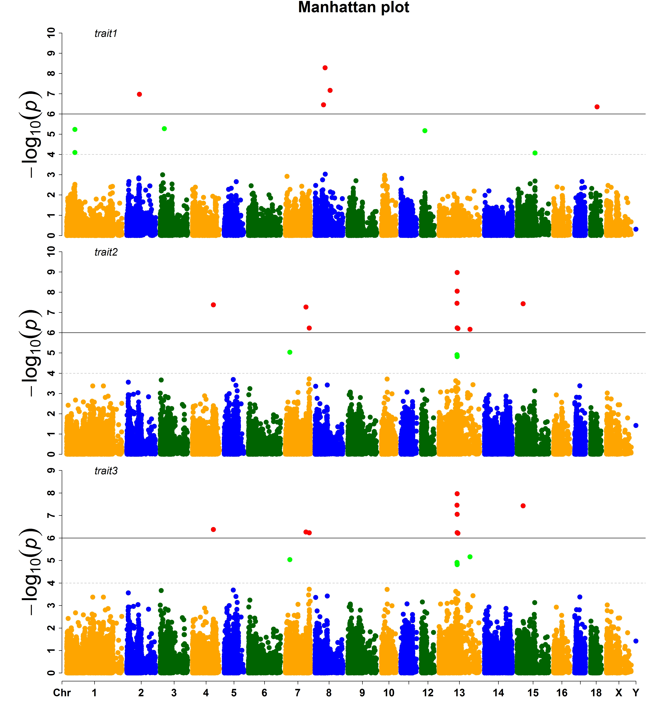
</a>
</p>

#### b. all traits in separated axes:

<p align="center">
<a href="https://raw.githubusercontent.com/YinLiLin/R-CMplot/master/Figure/5.jpg">
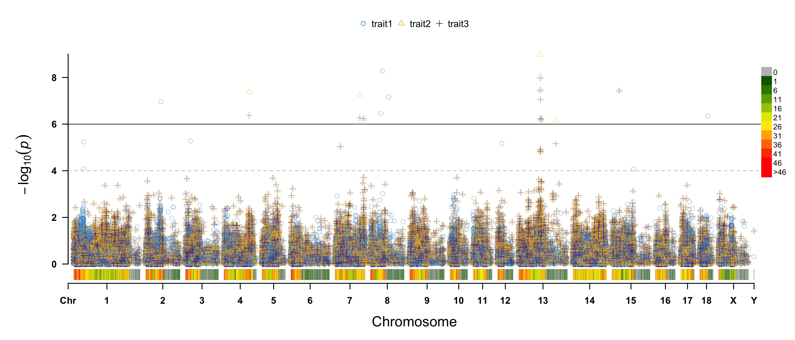
</a>
</p>

---

### Single_track Q-Q plot

```r
> CMplot(pig60K,plot.type="q",conf.int=TRUE,box=FALSE,file="jpg",memo="",dpi=300,
    ,file.output=TRUE,verbose=TRUE,width=5,height=5)
```

<p align="center">
<a href="https://raw.githubusercontent.com/YinLiLin/R-CMplot/master/Figure/6.jpg">
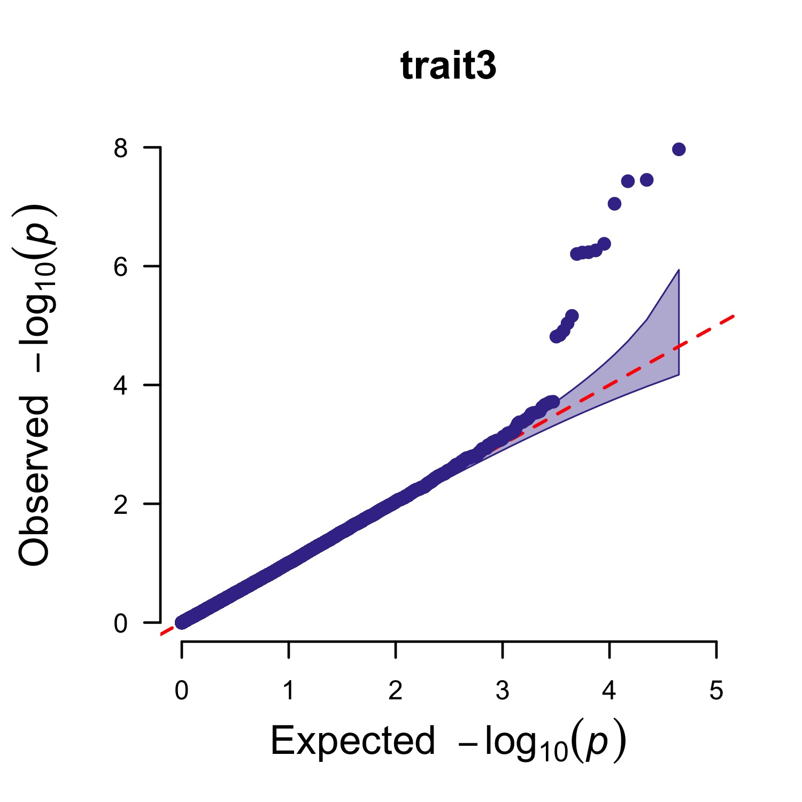
</a>
</p>

### Multi_tracks Q-Q plot

```r
> pig60K$trait1[sample(1:nrow(pig60K), round(nrow(pig60K)*0.80))] <- NA
> pig60K$trait2[sample(1:nrow(pig60K), round(nrow(pig60K)*0.25))] <- NA
> CMplot(pig60K,plot.type="q",col=c("dodgerblue1", "olivedrab3", "darkgoldenrod1"),threshold=1e-6,
        signal.pch=19,signal.cex=1.5,signal.col="red",conf.int=TRUE,box=FALSE,multracks=
        TRUE,file="jpg",memo="",dpi=300,file.output=TRUE,verbose=TRUE,ylim=c(0,8),width=5,height=5)
```

#### a. all traits in a axes:

<p align="center">
<a href="https://raw.githubusercontent.com/YinLiLin/R-CMplot/master/Figure/8.jpg">

</a>
</p>

#### b. all traits in separated axes:

<p align="center">
<a href="https://raw.githubusercontent.com/YinLiLin/R-CMplot/master/Figure/7.jpg">
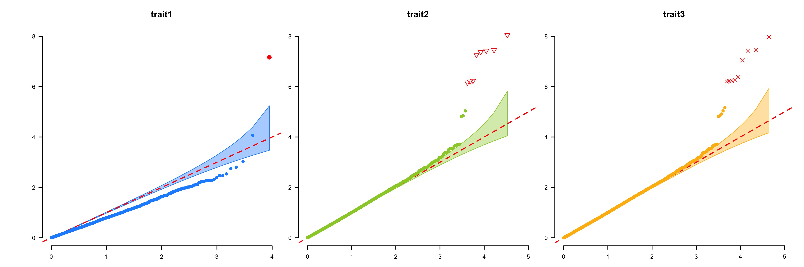
</a>
</p>

---

### Contact
Questions, suggestions, and bug reports are welcome and appreciated.
- **Author:** Lilin Yin
- **Contact:** ylilin@163.com
- **QQ group:** 166305848
- **Institution:** [*Huazhong agricultural university*](http://www.hzau.edu.cn/2014/ch/)
